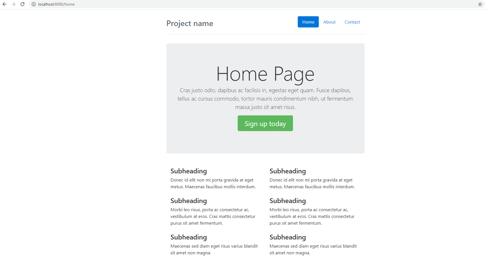

# web-app-template

Simple web app template written with Golang + Bootstrap 4

## Usage

Install [Golang](https://golang.org/)  
Clone this repo and go to that folder

```bash
go run main.go
```

Default server run on port 8080, browse to

[localhost:8080/home](http://localhost:8080/home)

Get result



## License

This repo is available as open source under the terms of the [MIT License](https://opensource.org/licenses/MIT).  
You are welcome to contribute!
